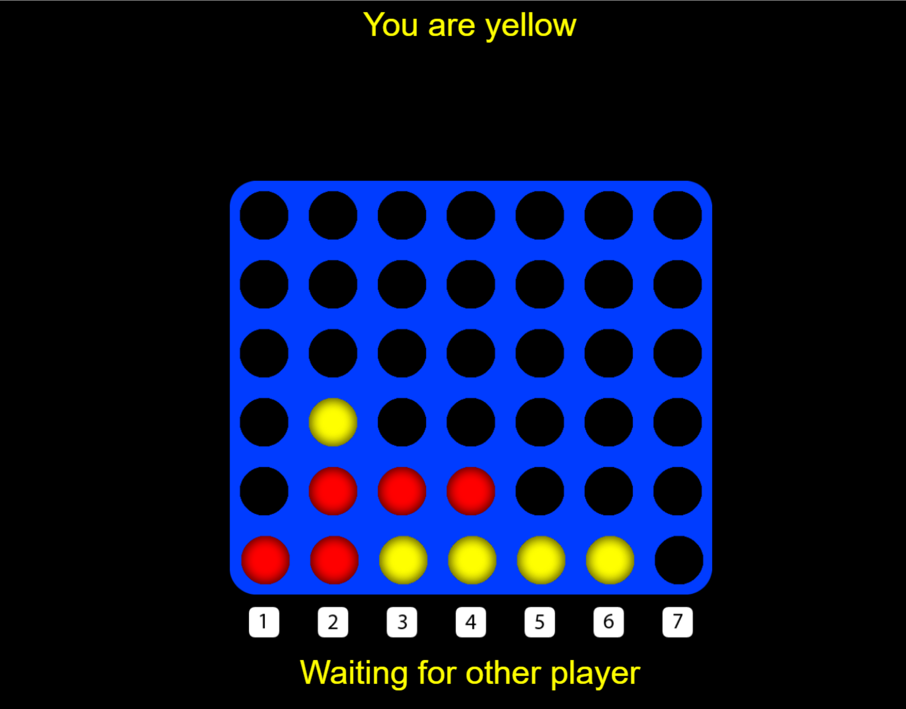

# connect4 🟡
Multiplayer connect4 online game with centralized server.

## Usage
```node index.js``` to start the server.

## Features
HTML5 javascript canvas browser client as frontend.

NodeJS server as backend.

Unlimited sessions can be hosted (so long memory allows).

Instant matchmaking with players.

## Known Issues
Algorithm does not detect a win when a piece is put in a line of four in between.

## Screenshot

